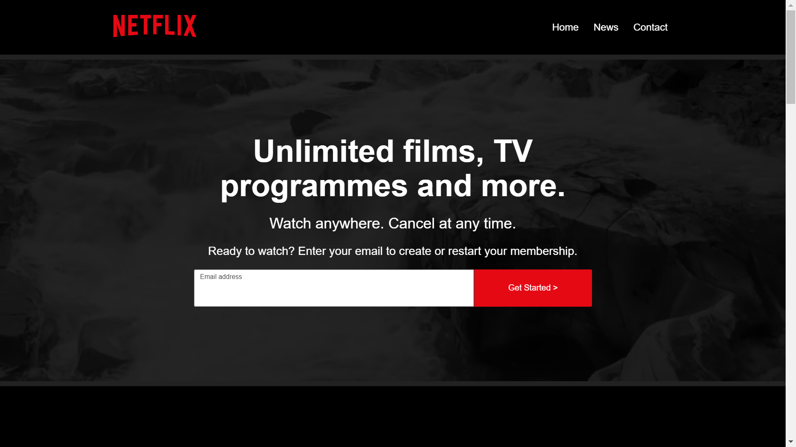

# Netflix Home Page Clone

A clone of Netflix's home page built with React.

## Quickstart

1. Clone the repository: `git clone https://github.com/rjkilpatrick/netflix-clone.git`
1. Navigate to the project directory: `cd netflix-clone`
1. Install dependencies: `npm install` or `yarn install`
1. Start the development server: `npm start` or `yarn start`

## Screenshot

## Motivation

The page design, all the art etc. is all &copy; Netflix, but I'm trying to improve my knowledge of React and my CSS skills are a little rusty.
